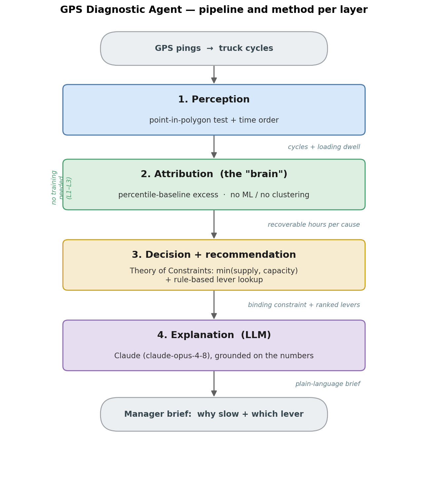

# GPS Mining Analytics — Project Overview

*A short guide to our data, our idea, and how we build the diagnostic agent.*

## 1. Goal

We study an open-pit coal mine in Tsogttsetii district, South Gobi, Mongolia (the Baruun Naran, or "BN", hauling circuit). We only have **GPS data from the truck fleet**. We do not have payload, fuel, dispatch, or shovel-sensor data. This limit is on purpose — it is the main point of our study: we want to see how much we can learn from GPS alone.

Our goal is to build a **diagnostic agent** for a mine manager. For one load zone, the agent should answer two questions in plain language: *why is this zone slow?* and *which action can help?*

## 2. Data

- **Raw GPS pings**, 5 months (July–November 2025), about 19 million points. Each point has time, latitude, longitude, speed, and a truck id.
- **`tracker_list`** — 123 vehicles. Dump trucks are the ones whose label contains `HDU` or `BN` (89 trucks).
- **`zone_list`** — 104 zones (load, dump, parking, repair, camp, fuel, weigh). We have real polygon shapes for 11 material (load/dump) zones; the others only have bounding boxes.
- The GPS is quite dense (median gap about 12 seconds), so cycle timing is precise enough.

For the agent we mainly use a cached table, `cycles_all_months.csv`, which already turns the raw pings into truck cycles.

## 3. Main idea (the pipeline)

A truck repeats a **cycle**: load → haul (loaded) → dump → return (empty) → load again. Our pipeline follows this idea step by step:

```
GPS pings → cycles → attribution → decision → recommendation → explanation
```

First we find the cycles. Then we measure where time is lost in each cycle. Then we use a simple operations-research method (Theory of Constraints) to find the *real* bottleneck, not just the biggest delay. Finally we map the bottleneck to a known action and explain it in simple words.



*Figure 1. The four layers of the agent and the method used in each one. Layers 1–3 need no training and no machine learning; layer 4 uses an LLM only to explain the result in plain words.*

## 4. How we build the agent (four layers)

The agent has four layers. Everything before the last layer is interpretable and needs **no training and no machine learning** — this is important because we have no ground-truth labels for "cause".

1. **Perception.** Method: point-in-polygon test plus time order. We check if a GPS point is inside a load or dump polygon, and from the enter/leave times we build cycles and the loading dwell (the time a truck waits and loads at the shovel).

2. **Attribution (the "brain").** Method: percentile-baseline excess. For each part of the cycle (loading, haul, dump, return), we compare its time to the best level the fleet actually reaches (a low percentile of its own distribution). The extra time above that baseline is "recoverable" time, and we put it into a named cause bucket: *idle standing*, *load queue*, *haul road*, *return road*, *dump*. This is not clustering — the cause is defined by position and baseline, so the result is easy to explain.

3. **Decision.** Method: Theory of Constraints. We measure the shovel service rate from the data (how fast loaded trucks depart when the shovel is busy), compute the throughput ceiling, and compare it with the current throughput. Then we run "what-if" tests: if we remove one bucket's extra time, does the throughput go up, or does it hit the shovel ceiling? This tells us the **binding constraint** and stops naive advice like "just widen the road".

4. **Explanation.** Method: a large language model (Claude). We give it the structured diagnosis (numbers only) and ask it to write a short manager brief. The prompt tells the model to use only the given numbers and to keep the honest limits. The output can be in English or Chinese.

## 5. Example result — BN load zone

- Current: 80.6 loads/day, 22 trucks, cycle about 222 minutes.
- The shovel can load about 7.3 trucks/hour but is used only about 50% — so the shovel is **not** the bottleneck.
- Two things cost loads: trucks **queue at the shovel and lose time on the road** (waste while actively cycling), and the fleet is **parked or off-shift** a large share of the month.
- Realistic prize (keeping today's fleet hours): cutting the queue and improving the road can lift 81 → about **124 loads/day (+54%)**, close to the best day already observed (109). Running more truck-hours (extra shifts, more available trucks) can push toward the shovel ceiling (~160), but that is a **separate staffing decision** — about 4,366 truck-hours a month is downtime, not dispatch waste.

*(Note: we first reported "+62%" from "cutting idle". On a closer look, most of that idle is trucks parked overnight — 82% of the idle hours span the small hours, median 18.7 h. So we split idle into on-shift idle and off-shift downtime, and now compute the ceiling on the real fleet availability. The corrected +54% is more honest and matches the best observed day.)*

We also ran the *same code* on a different flow (Middling). It gave a different answer (short cycle, road not important, the queue is the active lever). This shows the method **generalizes** and is not hard-coded for BN.

## 6. Honest limits

We are careful about what we claim:

- This is a **diagnostic**, not an optimizer. It does not control the trucks.
- The recoverable numbers are **upper bounds**, from November data only.
- The 6-hour line that separates on-shift idle from off-shift downtime is a **provisional, BN-tuned** value; it should scale with the cycle length when we generalize.
- We have **no payload data**, so the unit is loads and truck-hours, not tonnes.
- Observational data cannot *prove* an improvement. To prove a gain, the mine should run a **before/after pilot**: apply one action, then run the same analysis on the "after" data and measure the change.

## 7. Code

- `agent_diagnose.py` — layers 1–3. `diagnose(zone_id)` returns a structured result and writes `diagnosis_<zone>.json`.
- `agent_explain.py` — layer 4. `explain(...)` calls Claude and writes the manager brief.
- Both are self-contained on `cycles_all_months.csv`.

## 8. Next steps

- Generalize to the "other" region (handle multi-destination flows and make the time thresholds scale with the cycle length).
- Run the LLM layer live (needs an API key).
- Add month-by-month trends.
- Plan a small before/after pilot with the mine.
