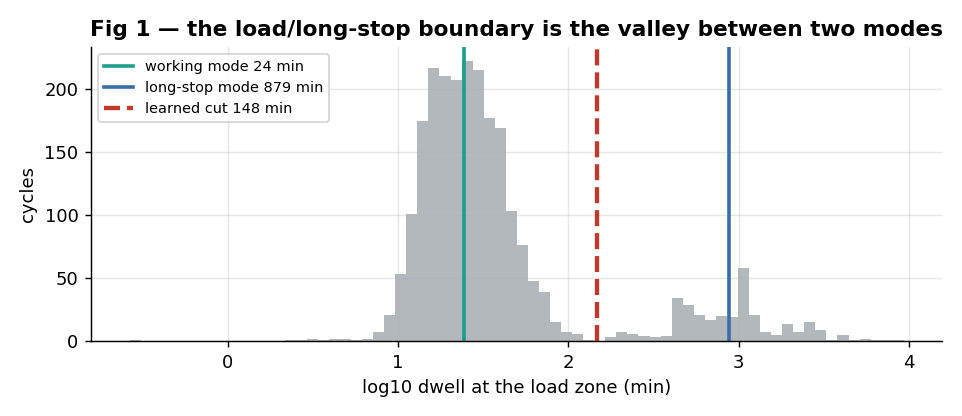

# Finding where a haul fleet loses time, from GPS alone

**Baruun Naran haul circuit — load zone 25559 · July–November 2025**

*Body text is the walkthrough; indented blocks are the same content phrased for reading aloud.*


---

## Contents

| Section | |
|---|
| [Step 0](#step-0--the-input) |
| [Overview](#overview--the-eight-steps) |
| [Step 1](#step-1--identify-the-trucks-and-the-zones) |
| [Step 2](#step-2--build-cycles) |
| [Step 3](#step-3--cut-each-cycle-into-four-phases) |
| [Step 3b](#step-3b--a-phase-duration-is-not-a-driving-duration) |
| [Step 4](#step-4--find-the-places-on-the-route) |
| [Step 5](#step-5--assign-every-minute-to-exactly-one-place) |
| [Step 6](#step-6--delay--actual--reference) |
| [Step 7](#step-7--how-fast-each-station-can-go) |
| [Step 8](#step-8--convert-delay-hours-into-loads-per-day) |
| [Output](#output--result-for-bn-november-2025) |
| [Checks](#checks--five-months) |

---
---

# Step 0 — The input

Four files, all from the mine's existing tracking system.

| File | Contents | Scale |
|---|---|---|
| `gps_data_2025-{7..11}.csv` | time, latitude, longitude, speed, odometer, parking flag, vehicle id | 300–800 MB per month |
| `tracker_list.csv` | vehicle id → vehicle type and fleet | 123 vehicles, 89 haul trucks |
| `zone_list.csv` | the areas the mine has drawn: name + bounding box | 104 zones |
| `zone_detail_all_df.csv` | polygon vertices | **only 11 of the 104 zones** |

Ping interval: median 12 s, 97.7% under 30 s.

**Not available:** payload, fuel, dispatch records, shovel run-time.
→ every result is in **loads and truck-hours**, never tonnes.

**93 of the 104 zones have no polygon**, only a bounding box. Those are approximated as the box plus a 100 m buffer.

> The input is four files from the mine's existing tracking system. The pings carry time, position, speed, an odometer reading, a parking flag and the vehicle id. The vehicle list tells us which of the 123 vehicles are haul trucks — 89 of them. The zone list is the areas the mine has drawn, 104 of them, each with a name and a bounding box. The fourth file has actual polygon vertices, but only for 11 zones.
>
> Two things we do not have. No payload, fuel, dispatch records or shovel run-time, so everything downstream is in loads and truck-hours rather than tonnes. And 93 of the 104 zones have only a box, which we approximate with a 100 metre buffer.


---
---

# Overview — the eight steps


| Step | What it produces |
|---|---|
| 1 | trucks and zones identified |
| 2 | cycles: load → dump → load |
| 3 | each cycle cut into four phases |
| 4 | the places on the route, classified |
| 5 | every minute assigned to exactly one place |
| 6 | **delay = actual − reference, per phase** |
| 7 | station rates and utilisation |
| 8 | delays converted to loads/day, ranked |

Each step consumes the output of the one before it. No step requires anyone to say what a place is used for.

> Eight steps. Identify trucks and zones. Build cycles. Cut each cycle into four phases. Find out which places lie on the route and classify them. Assign every minute to exactly one place. Compute delay as actual minus a reference, per phase. Measure how fast each station can go and how heavily it is used. Then convert the delays into loads per day and rank them.


---
---

# Step 1 — Identify the trucks and the zones

**Trucks.** `tracker_list` has a type field; keep `type = dump` → 89 haul trucks. The fleet (BN or other) is read from the vehicle label.

**Zones.** The mine labels its own areas. A zone is a **load zone** if its label contains the Mongolian word for loading (`ачилт`); otherwise it is a **dump zone**.

The 11 zones with polygon vertices are exactly the load and dump zones — which is what Step 2 needs. The other 93 (weighbridges, car parks, tarping points, junctions) have only a box; they enter at Step 4.

**Scope of this walkthrough:** load zone 25559, and the trucks that used it — 22 trucks, 30 days, November 2025.

> For trucks, the vehicle list has a type field; keeping type equal to dump gives 89 haul trucks. For zones, the mine labels its own areas, and a zone is a loading zone if its label contains the Mongolian word for loading. The 11 zones that have polygon vertices are exactly the load and dump zones, which is what cycle construction needs. The other 93 have only a box and come in later. This walkthrough follows one load zone and the 22 trucks that used it in November.

---
---

# Step 2 — Build cycles

**A cycle is the interval between two consecutive departures from the load zone.**

1. Join every ping to the 11 polygons → each ping is inside a zone, or nowhere.
2. Collapse consecutive pings in the same zone into one **visit**: `(zone, arrive, depart)`.
3. Walk the visit sequence per truck. Every `load → dump → load` is one cycle.
4. Discard cycles longer than **6 h** — those span an equipment outage or a rest period, not a trip.

| Output column | Meaning |
|---|---|
| `depart_load, arrive_unload, depart_unload, arrive_load` | the four timestamps |
| `haul_s, dump_s, return_s` | duration of each phase |
| `haul_km, return_km` | path length, summed from consecutive ping distances |
| `load_zone, unload_zone, tracker_id, date` | keys |

**BN, November 2025: 2 417 cycles · 22 trucks · 30 days.**

> A cycle is the interval between two consecutive departures from the load zone. Four operations: join every ping to the polygons, collapse consecutive pings in one zone into a visit, walk the visit sequence and read off every load-then-dump-then-load as one cycle, and discard anything longer than six hours. The output has four timestamps per cycle, the duration of each phase, and the path length of each leg. For BN in November that is 2 417 cycles across 22 trucks and 30 days.


---
---

# Step 3 — Cut each cycle into four phases


| Phase | Defined as | BN mean |
|---|---|---|
| **HAUL** (loaded) | `depart_load → arrive_unload` | 75.2 min |
| **DUMP** | `arrive_unload → depart_unload` | 18.9 min |
| **RETURN** (empty) | `depart_unload → arrive_load` | 87.8 min |
| **DWELL** at the load zone | `arrive_load → next depart_load` | 50.3 min |

The dwell covers loading itself plus any waiting to be loaded.

> Four phases, defined purely by the four timestamps. Haul loaded, from leaving the load zone to arriving at the dump. Dump. Return empty, from leaving the dump to arriving back. And dwell at the load zone, which covers loading itself and any waiting to be loaded. BN means are 75, 19, 88 and 50 minutes.

---
---

# Step 3b — A phase duration is not a driving duration

A phase is defined by two timestamps, so its duration includes **anything the truck did in between, including standing still**.


**Truck 34065, 3 November — one "empty return":**

```
17:17  left the dump
       drove          12 min
       STOPPED       105 min   at a car park
       drove          47 min
       STOPPED        26 min   at the pit gate
       drove           2 min
20:28  reached the load zone

phase duration 191 min  =  61 min driving  +  130 min stationary
```

Across the whole month, **56% of haul + return time is a truck actually driving.**

> This is the point that determines everything downstream. A phase is defined by two timestamps, so its duration includes anything the truck did in between, including standing still. Here is one return phase — 191 minutes, of which 61 were driving and 130 were stationary, at a car park and at the pit gate. Across the whole month, 56 percent of haul plus return time is a truck actually driving. Steps 4 and 5 find out where the other 44 percent goes, and step 6 decides how each part is judged.


---
---

# Step 4 — Find the places on the route

Two measurements, applied to **all 104 zones**. Neither reads a place name.

**Coverage** = visits during haul/return phases ÷ number of cycles
→ a place passed on both phases of every trip scores ≈ 200%

**Stop rate** = share of those visits containing at least one ping at ≤ 2 km/h
→ separates a place trucks **stop at** from a place they **drive through**


## Three classes

| Class | Test | BN result | Treatment |
|---|---|---|---|
| **STATION** | coverage ≥ 150% **and** stop rate ≥ 0.5 | 5 places, stop rate **0.91–0.97**: two weighbridges, two tarping points, the pit gate | part of the loop — has a service time and can have a queue |
| **WAYPOINT** | coverage ≥ 150% **but** stop rate < 0.5 | 6 places, stop rate **0.00–0.14**: junctions, turns, mileposts | its time counts as driving |
| **OUT OF LOOP** | coverage < 100% | car park 16% of trips (median 40 min), klonk 42% | removed from the loop, reported separately |

**Why the stop-rate test is needed.** Junctions are passed by every truck on every trip, so coverage alone would classify four road junctions as stations.

**Why places below 100% must be removed.** The reference in Step 6 is built from the fastest trips. A place visited on only 16% of trips does not appear in those fast trips, so its time would be charged in full to the road — a shift handover would be reported as road delay.

**Merging.** Zones whose boxes overlap are merged first: the tarping point and the weighbridge beside it are 100 m apart, and a truck queues once for the pair. BN ends up with two station complexes — one at the pit end, one at the dump end.

> We need to find out what else is on this loop, and we cannot ask the site what anything is. So for all 104 zones we ask the GPS two questions. First, does every trip pass here — visits divided by cycles, so a place passed on both phases of every trip scores about 200 percent. Second, do trucks actually stop, or just drive through — the share of visits containing a ping at two kilometres an hour or below.
>
> The second question is not optional. Junctions are passed by every truck on every trip too, so coverage alone would classify four road junctions as stations.
>
> Three classes come out. Stations: coverage around 200 percent and trucks stop — two weighbridges, two tarping points and the pit gate, stop rates between 0.91 and 0.97. Waypoints: coverage around 200 percent but nobody stops, stop rates between zero and 0.14; their time counts as driving. And anything below 100 percent coverage is removed from the loop entirely — the car park is visited on 16 percent of trips for a median of 40 minutes, and if it stayed in, that shift handover would be reported as road delay.


---
---

# Step 5 — Assign every minute to exactly one place

For every consecutive pair of pings inside a haul or return phase, the interval is charged to:

- the **smallest zone box** containing the earlier ping, if there is one
- otherwise **DRIVING** if speed > 2 km/h
- otherwise **STOPPED-UNMAPPED**

Intervals longer than 5 minutes are capped at 5 (GPS gaps; 0.3% of intervals).
Smallest box wins, so a large box cannot absorb the pings of a small one inside it.


**The identity:**

```
phase duration  =  Σ station time  +  driving  +  stopped-unmapped  +  out-of-loop
```

Checked against actual phase durations: **the two sides agree to within 0.8%.**

## Checking the "stopped" rule against an independent sensor

The rule is ours. The odometer is a different sensor from the GPS position.

| Intervals classified as | Total duration | Odometer advanced | Implied speed |
|---|---|---|---|
| **STOPPED** (speed ≤ 2 km/h) | 6 615 truck-h | 1 697 km | **0.3 km/h** |
| **DRIVING** | 6 370 truck-h | 225 363 km | **35.4 km/h** |

Only **0.7%** of the time classified as stopped shows any odometer movement.
The device's own parking flag agrees **92%** of the time, and every disagreement is one-directional — the flag is set a little after the truck comes to rest.

> Every consecutive pair of pings inside a phase gives an interval, and that interval is charged to the smallest zone box containing the earlier ping. If no box contains it, the interval is driving if the speed is above two kilometres an hour, and stopped-unmapped if not. The result is an identity: phase duration equals station time plus driving plus stopped-unmapped plus out-of-loop time, and the two sides agree to within 0.8 percent.
>
> The "stopped" rule is ours, so we checked it against the odometer, which is a different sensor. Over the intervals we call stopped, the odometer advanced at 0.3 kilometres an hour. Over the intervals we call driving, 35.4. Only 0.7 percent of stopped time shows any odometer movement at all.

---
---

# Step 6 — Delay = actual − reference

**This is the core of the method.** Every phase has a measured quantity and a reference; the delay is the difference.

| Phase | Quantity measured | Compared against | Where the reference comes from | BN value |
|---|---|---|---|---|
| **Loading** | dwell at the load zone | no-queue loading time | 20th percentile of dwell, capped at the learned boundary | 16.2 min |
| **Station** | time inside a station box | service time | **median dwell of visits where no other truck was present** | 2.4–8.2 min |
| **Dump** | time inside the dump zone | clean dump time | 20th percentile of dump duration | 3.7 min |
| **Haul road** | **driving time only**, loaded | free-flow time | 15th percentile of driving-only haul time | 44.6 min |
| **Return road** | **driving time only**, empty | free-flow time | 15th percentile of driving-only return time | 37.9 min |

**Every reference is a low quantile of this fleet's own distribution for that same phase** — what this fleet achieves when nothing is in the way. Nothing is compared against a manufacturer's figure or a management target.

**The station reference is not a quantile at all.** It is measured directly: the median dwell across the visits where no other truck was present.

## The learned boundary

The loading reference needs one boundary — where "loading and queueing" ends and "a long stop" begins.



Take the log of every dwell, fit two Gaussians. Working mode 24.5 min (87% of the mass), long-stop mode 878 min. The boundary is the density valley between them: **147.6 min for BN November**, recomputed for every zone and every month.

> This is the core of the method, so I'll go through the table row by row. Every phase has a measured quantity and a reference, and the delay is the difference.
>
> Loading: we measure dwell at the load zone, against what loading takes when there is no queue — the twentieth percentile of dwell, 16.2 minutes.
>
> Station: we measure time inside the station's box, against a service time that is not a percentile at all. It is the median dwell across the visits where no other truck was present.
>
> Dump: time inside the dump zone, against the twentieth percentile.
>
> Haul road: driving time only, against the fifteenth percentile of driving-only haul time. Return road the same.
>
> So every reference is a low quantile of this fleet's own distribution for that same phase — what this fleet achieves when nothing is in the way. We are not comparing against a manufacturer's figure or a target.
>
> The boundary for loading is learned rather than chosen: take the log of every dwell, fit two Gaussians, take the valley between them. For BN in November that is 147.6 minutes, and it is recomputed for every zone and every month.


---

## Step 6b — Waiting at the load zone: four cases

The dwell at the load zone mixes four different things. **The test is not duration** — it is how many other trucks were already inside the load zone when this truck arrived (counting only short, non-overnight stays, so a truck parked there for hours does not count as blocking anyone).

| Case | Test | Real example (BN, November) | Waiting | Counts as |
|---|---|---|---|---|
| **loading variation** | short, no other truck present | dwell **20.4 min**, 0 trucks ahead | 4.2 min | not a delay |
| **QUEUE** | ≥1 truck already present, not overnight | dwell **45.9 min**, **4 trucks ahead** | 29.7 min | delay, inside the loop |
| **overnight parking** | still there at 03:00, longer than the boundary | dwell 1 928.8 min | 1 912.6 min | outside the loop — roster |
| **on-shift idle** | long, daytime, no other truck present | dwell 726.9 min, 0 trucks ahead | 710.7 min | outside the loop — dispatch |

**Compare the first two.** 20 minutes and 46 minutes. Judged on duration alone they are the same kind of event. The difference is that one had four trucks in front of it.

**November totals:** queue **1 374** truck-h · overnight parking **4 893** · on-shift idle **266**

> The dwell at the load zone mixes four different things, and the test that separates them is not how long the truck waited. It is how many other trucks were already inside when it arrived.
>
> First case, loading variation: short, nothing else present — a dwell of 20 minutes with zero trucks ahead. We do not count that as a delay; that is just how long loading took.
>
> Second, a queue: 46 minutes with four trucks ahead. That is a delay inside the loop.
>
> Third, overnight parking. Fourth, a long daytime stop with nothing else present, which is a dispatch question rather than a queue.
>
> Compare the first two — twenty minutes and forty-six. Judged on duration alone they are the same kind of event. The difference is that one had four trucks in front of it.

---

## Step 6c — Waiting at a station: three parts

| Part | Definition |
|---|---|
| **service** | `min(dwell, median dwell when no other truck was present)` |
| **queue** | the excess, when ≥1 truck was already there on arrival |
| **unexplained** | the excess when **no** other truck was there — reported on its own |

The third part is **not** added to service and **not** added to queue, because we cannot say what caused it.

| Station complex | Total | Service | Queue | Unexplained | Service time |
|---|---|---|---|---|---|
| weighbridge + tarping, **dump side** | 990 h | 343 | **583** | 64 | 4.6 min |
| gate + weighbridge + tarping, **pit side** | 917 h | 520 | **368** | 28 | 8.2 min |

**The test that the middle part behaves like a queue:** dwell should rise with the number of trucks already present.


It does at every station — median dwell rises from **2.7 min at zero trucks to 6.4 min at four**. The correlation is weaker than at the load zone (Spearman ≈0.2 against 0.35), so this supports the reading rather than establishing it.

> At a station we do the same split, three parts. Service is the dwell capped at the median dwell measured when no other truck was present. Queue is the excess when at least one truck was already there. And the excess when no other truck was there is reported on its own — we do not add it to service and we do not add it to queue, because we cannot say what caused it.
>
> The test that the middle part behaves like a queue is that dwell should rise with the number of trucks already present. It does at every station, from 2.7 minutes at zero trucks to 6.4 at four. The correlation is weaker than at the load zone, so this supports the reading rather than establishing it.

---
---

# Step 7 — How fast each station can go

Sort the departures from a zone, take the gap between consecutive ones.

**Keep only gaps under 30 minutes.** A longer gap is a period when the station was idle waiting for a truck, so including it would measure how often trucks arrive rather than how fast the station can work.


```
median kept gap  =  8.25 min per load        ← a PERIOD
rate             =  60 ÷ 8.25 = 7.27 loads/h  ← a RATE
```

The **60** converts minutes to an hour. The **division** is because a rate is the reciprocal of a period — like litres per 100 km versus kilometres per litre.

Dump zone, same method: **8.34 loads/h**.

## Operating hours


Group all departures by hour of day; take the mean across the 24 hours. An hour counts as operating if its count reaches **0.4 × that mean**.

Only **06:00 and 18:00** fall below — the two shift handovers. So **22 of 24 hours** count.


**The 0.4 is a chosen value.** Thresholds of 0.2, 0.3 and 0.4 all give 22 hours: the lowest surviving hour is at 0.41 × mean, and the two excluded hours are at 0.05.

## Utilisation

| | Formula | BN November |
|---|---|---|
| flow | loads per day ÷ operating hours | 80.6 ÷ 22 = **3.66 loads/h** |
| utilisation, shovel | flow ÷ shovel rate | 3.66 ÷ 7.27 = **0.50** |
| utilisation, dump | flow ÷ dump rate | 3.66 ÷ 8.34 = **0.44** |
| binding station | the higher utilisation, compared against **1.0** | **shovel, at half capacity** |

> To know how fast a station can go, sort its departures and take the gap between consecutive ones. Keep only gaps under thirty minutes — a longer gap is a period when the station was idle waiting for a truck, so including it would measure arrivals rather than capacity.
>
> The median kept gap is a period, in minutes per load: 8.25 minutes at the BN shovel. To turn that into a rate we divide — sixty minutes per hour over 8.25 minutes per load gives 7.27 loads per hour. The sixty converts minutes to an hour, and the division is because a rate is the reciprocal of a period.
>
> For utilisation we also need how many hours a day the operation runs. Group departures by hour of the day; an hour counts as operating if it reaches 0.4 times the mean across the 24 hours. Only six in the morning and six in the evening fall below — the shift handovers — so 22 of 24 hours count. That 0.4 is a chosen value; 0.2, 0.3 and 0.4 all give 22 hours.
>
> Flow is then 80.6 loads over 22 hours, 3.66 an hour. Utilisation is 0.50 at the shovel and 0.44 at the dump, compared against 1.0 which is full. The shovel is the more heavily used of the two, at half capacity.

---
---

# Step 8 — Convert delay hours into loads per day

The delays from Step 6 are in truck-hours. To rank them we need loads per day.

**The identity:**

```
cycling truck-hours per day  =  loads per day × loop time ÷ 60
                        312  =  80.6 × 232.2 ÷ 60

read the other way:
loads per day  =  truck-hours × 60 ÷ loop time
```

Two kinds of delay convert differently:


| | Applies to | What changes |
|---|---|---|
| **a — shorten the loop** | delay **inside** the loop: queue, dump, station waiting, slow driving | truck-hours held at 312, **loop time drops** |
| **b — add looping hours** | time **outside** the loop: idle, parked | loop time held at 232 min, **truck-hours rise** |

**Assumption in (a):** the fleet keeps committing the same truck-hours once the loop is shorter. If the response is to park trucks instead, the gain does not appear.

## Worked example — the queue at the load zone

| Step | Arithmetic | Result |
|---|---|---|
| bucket (from Step 6) | — | 1 374 truck-h / month |
| per day | 1 374 ÷ 30 | 45.8 truck-h/day |
| per load | 45.8 ÷ 80.6 loads | 0.568 h = **34.1 min** |
| new loop time | 232.2 − 34.1 | **198.1 min** |
| new loads per day | 312 × 60 ÷ 198.1 | **94.5** |
| gain | 94.5 − 80.6 | **+13.9 loads/day** |

**Two properties worth knowing.**

The obvious shortcut — freed hours ÷ loop time — gives **+11.8**, not 13.9. The difference is that shortening the loop also makes the truck-hours **already in it** more productive.

**The gains are not additive.** The eight items sum to **+38.9/day** individually; removing all of them at once gives **+60.7**. Loads per day varies inversely with loop time, so each further minute removed is worth more than the last. **The ranking is used for ordering only** — we never publish a sum.

> The delays are in truck-hours; to rank them we need loads per day. Start from an identity: cycling truck-hours per day equals loads per day times loop time over sixty — 312 equals 80.6 times 232.2 over sixty. Read the other way, loads per day equals truck-hours times sixty over loop time.
>
> Two kinds of delay. Delay inside the loop — queue, dump, station waiting, slow driving — where the truck is in the loop but not producing. Removing it shortens the loop, so the same truck-hours produce more loads. And time outside the loop — idle, parked — where the truck is not in the loop at all; recovering it adds truck-hours to the same loop.
>
> Worked through for the queue: 1 374 truck-hours a month is 45.8 a day, which spread over 80.6 loads is 34.1 minutes per load. The loop drops from 232 to 198 minutes, and the same 312 truck-hours now give 94.5 loads a day. A gain of plus 13.9.
>
> Two things to know. The obvious shortcut, freed hours over loop time, gives 11.8 rather than 13.9 — the difference is that a shorter loop also makes the existing truck-hours more productive. And the gains are not additive: individually the eight items sum to 38.9 a day, but removing all of them at once gives 60.7. So the ranking is used for ordering only.

---
---

# Output — result for BN, November 2025


| # | Lever | Bucket | Mechanism | Gain |
|---|---|---|---|---|
| 1 | Queue at the shovel | 1 374 h | a | **+13.9** |
| 2 | Dump spotting / congestion | 634 h | a | +5.9 |
| 3 | Queue, dump-side station complex | 583 h | a | +5.4 |
| 4 | Stopped, unmapped · *unexplained* | 405 h | a | +3.6 |
| 5 | Queue, pit-side station complex | 368 h | a | +3.3 |
| 6 | On-shift idle | 266 h | **b** | +2.3 |
| 7 | Haul road, loaded — *driving time only* | 232 h | a | +2.1 |
| 8 | Haul road, empty — *driving time only* | 179 h | a | +1.6 |

**Reported separately — outside dispatch control:** overnight parking 4 893 h · shift handover 584 h

---

## Four rules before reporting

**1. Separate what dispatch cannot change.**
Overnight parking and the shift handover leave the ranking and are reported on their own.
*Without this, "add a night shift" at +42/day would be the first line on a dispatcher's list — and a dispatcher cannot add a shift.*


**2. Do not name a first place inside the noise.**
Name a single winner only if it leads the second by **≥ 5 loads/day**.


*The threshold is measured: across 3 material flows × 5 months × 5 parameter settings, every change in first place occurred when the lead was 1–4 loads/day; of the 20 cases with a lead of 5 or more, **none changed**.*

| Month | #1 | #2 | Margin | Verdict |
|---|---|---|---|---|
| September | queue at the shovel +10.1 | dump-side complex +6.9 | 3.2 | **tied — report both** |
| November | queue at the shovel +13.9 | dump spotting +5.9 | 8.0 | a real winner |

**3. Label what is measured but not explained.**
"Stopped, unmapped" is 4th at 405 truck-h. The odometer confirms the trucks were stationary, but we cannot say where or why — 93 zones have no polygon. It carries a label saying so.

**4. Report a range, not a point.**


| | Value | Basis |
|---|---|---|
| **floor** | **+21%** | every normal day matches this fleet's own best day — *it has been achieved* |
| of which | +8% | more trucks turned out — maintenance |
| of which | **+10%** | **more trips per truck — the part that depends on dispatch** |
| **ceiling** | +75% | all in-loop delay removed at once — *never observed* |

*The floor has a known weakness: it measures variation between days, so an operation that is uniformly slow would score +0%.*

**Stoppage days are reported on their own:** 4 days in November cost 285 loads = **12% of the month** — larger than every dispatch lever, and not a dispatch problem.

---

## What the agent outputs

> **The constraint is not loading capacity.** The shovel is at 50% utilisation, and 1 374 truck-hours of queue sit in front of it. Queueing in front of a station that is idle half the time points to uneven arrivals rather than insufficient loading capacity.
>
> **First priority: smooth the arrivals** — +13.9 loads/day, leading the second item by 8.0.
> Then dump spotting (+5.9) and the dump-side station queue (+5.4).
>
> **The road is not the problem.** Driving-only medians are 49.7 min loaded and 41.7 min empty — the empty truck is faster, as it should be. Both road items together are worth +3.7/day, ranked 7th and 8th.
>
> **Outside dispatch control, and larger:** overnight parking 4 893 truck-h; four stoppage days costing 12% of the month.
>
> **Recoverable: +21%** with observational support, of which about **+10 percentage points** depends on trips per truck rather than on how many trucks were turned out.
>
> **This is a diagnosis.** Showing that acting on any of these produces the gain requires a before/after comparison.

> Here is what comes out. The shovel is at 50 percent utilisation and 1 374 truck-hours of queue sit in front of it. Queueing in front of a station that is idle half the time points to uneven arrivals rather than insufficient loading capacity.
>
> First priority is smoothing the arrivals, worth plus 13.9 loads a day and leading the second item by 8.0. Then dump spotting and the dump-side station queue.
>
> The road is not the problem. Looking only at driving time, the medians are 49.7 minutes loaded and 41.7 empty — the empty truck is faster, as it should be. Both road items together are worth plus 3.7 a day, ranked seventh and eighth.
>
> Larger than any of these but outside dispatch control: overnight parking, and four stoppage days costing twelve percent of the month.
>
> Recoverable is plus 21 percent with observational support, of which about ten percentage points depends on trips per truck rather than on how many trucks were turned out.
>
> And this is a diagnosis. Showing that acting on any of these produces the gain requires a before-and-after comparison.

---
---

# Checks — five months


Same code, five months, nothing adjusted between them.

| | Jul | Aug | Sep | Oct | Nov |
|---|---|---|---|---|---|
| loads per day | 48.5 | 78.0 | 77.6 | 88.3 | 80.6 |
| shovel utilisation | 0.43 | 0.52 | 0.53 | 0.59 | 0.50 |
| share of phase time actually driving | 56% | 58% | 57% | 57% | 56% |
| rank of the empty-return road | 7 | 8 | 8 | 8 | 8 |
| first place named, or tied | tied | tied | tied | named | named |

> Same code on five months, nothing adjusted between them. Loads per day range from 48 to 88. Shovel utilisation from 0.43 to 0.59 — never near full. The share of phase time actually driving stays between 56 and 58 percent. The empty-return road is seventh or eighth every month. And first place is named in two of the five months and reported as a tie in three.

---

## Chosen values, and what was tested

| Value | Used for | Tested over | Result |
|---|---|---|---|
| **p15 / p20** | free-flow and clean-service references | p10 → p30, 5 months, 2 reference sets (50 runs) | ranking unchanged; recoverable % moves +65 → +99 |
| **30 min** | which departure gaps count as "busy" | 10–90 min × 5 operating-hour thresholds × 5 months (175 runs) | shovel utilisation 0.23–0.67, never reaches 1.0; binding station unchanged in **175/175** |
| **0.4 × mean** | which hours count as operating | same 175 runs | 0.2, 0.3, 0.4 all give 22 hours |
| **0.5 stop rate** | station vs waypoint | the observed distribution | on-route places sit at 0.00–0.14 or 0.91–0.97 — **nothing in between** |
| **2 km/h** | stopped vs driving | odometer, and 1 / 2 / 5 km/h | odometer 0.3 vs 35.4 km/h; ranking unchanged |

**One thing did not survive.** The ceiling implied by the station rates moves **125–273 loads/day** across the same 175 runs. It is used internally as a cap but **is not reported as a figure**.

---

## Limits

**The function of a station is not verified.**
We can show that trucks stop at five fixed places on every trip, for 3–8 minutes, and that the wait grows when other trucks are present. The names come from the mine's own zone labels.
→ the correct phrasing is *"trucks dwell here for 5.8 minutes"*, **not** *"tarping takes 5.8 minutes"*.

**Zone geometry.** 93 of 104 zones are rectangles plus a buffer. The "stopped, unmapped" item is largely a consequence of that. Closing it needs the zone API.

**Units.** No payload data, so loads and truck-hours only — never tonnes.

**Coverage.** One material flow, one mine, July to November. **No winter months.**

**Status.** This is a diagnosis, not a demonstrated improvement. One natural comparison may already exist in the data: **the dump-side station queue halves from September and stays down** — worth asking the site whether something changed there.

> Five limits. The function of a station is not verified — we can show trucks stop at five fixed places for three to eight minutes and that the wait grows when others are present, but the names come from the mine's own labels, so the correct phrasing is "trucks dwell here for 5.8 minutes", not "tarping takes 5.8 minutes". 93 of 104 zones are rectangles plus a buffer, and the unmapped item is largely a consequence of that. No payload data, so loads and truck-hours only. One flow, one mine, July to November, no winter. And this is a diagnosis rather than a demonstrated improvement — although one natural comparison may already be in the data, since the dump-side queue halves from September and stays down.

---
---

## Appendix — the figures used

| File | Shows |
|---|---|
| `t_fig_pipeline.png` | the eight steps |
| `c_fig_phases.png` | the four phases of a cycle |
| `c_fig_onetrip.png` | truck 34065, one return phase broken down |
| `v4_fig2_topology.png` | coverage vs stop rate, all zones |
| `v4_fig3_legs.png` | where phase time goes |
| `v4_fig1_gmm.png` | the learned dwell boundary |
| `v4_fig4_conc.png` | dwell vs concurrency at each station |
| `t_fig_gaps.png` | departure gaps → shovel rate |
| `t_fig_hours.png`, `t_fig_hours_sens.png` | operating hours and the 0.4 threshold |
| `t_fig_mechanisms.png` | the two conversions |
| `t_fig_levers.png` | the ranked result |
| `t_fig_ownership.png` | dispatch vs roster |
| `t_fig_tierule.png` | where the 5 loads/day margin comes from |
| `v4_fig7_range.png` | floor and ceiling per month |
| `v4_fig6_months.png` | five-month stability |