# Finding where a haul fleet loses time, from GPS alone

**Baruun Naran haul circuit — load zone 25559 · July–November 2025**

*Body text is the walkthrough; indented blocks are the same content phrased for reading aloud.*


---

## Contents

| Section | |
|---|
| [Step 0](#step-0--the-input) |
| [Overview](#overview--the-eight-steps) |
| [Step 1](#step-1--identify-the-trucks-and-the-zones) |
| [Step 2](#step-2--build-cycles) |
| [Step 3](#step-3--cut-each-cycle-into-four-phases) |
| [Step 3b](#step-3b--a-phase-duration-is-not-a-driving-duration) |
| [Step 4](#step-4--find-the-places-on-the-route) |
| [Step 5](#step-5--assign-every-minute-to-exactly-one-place) |
| [Step 6](#step-6--delay--actual--reference) |
| [Step 7](#step-7--how-fast-each-station-can-go) |
| [Step 8](#step-8--convert-delay-hours-into-loads-per-day) |
| [Output](#output--result-for-bn-november-2025) |
| [Checks](#checks--five-months) |

---
---

# Step 0 — The input

Four files, all from the mine's existing tracking system.

| File | Contents | Scale |
|---|---|---|
| `gps_data_2025-{7..11}.csv` | time, latitude, longitude, speed, odometer, parking flag, vehicle id | 300–800 MB per month |
| `tracker_list.csv` | vehicle id → vehicle type and fleet | 123 vehicles, 89 haul trucks |
| `zone_list.csv` | the areas the mine has drawn: name + bounding box | 104 zones |
| `zone_detail_all_df.csv` | polygon vertices | **only 11 of the 104 zones** |

Ping interval: median 12 s, 97.7% under 30 s.

**Not available:** payload, fuel, dispatch records, shovel run-time.
→ every result is in **loads and truck-hours**, never tonnes.

**93 of the 104 zones have no polygon**, only a bounding box. Those are approximated as the box plus a 100 m buffer.

> The input is four files from the mine's existing tracking system. The pings carry time, position, speed, an odometer reading, a parking flag and the vehicle id. The vehicle list tells us which of the 123 vehicles are haul trucks — 89 of them. The zone list is the areas the mine has drawn, 104 of them, each with a name and a bounding box. The fourth file has actual polygon vertices, but only for 11 zones.
>
> Two things we do not have. No payload, fuel, dispatch records or shovel run-time, so everything downstream is in loads and truck-hours rather than tonnes. And 93 of the 104 zones have only a box, which we approximate with a 100 metre buffer.


---
---

# Overview — the eight steps

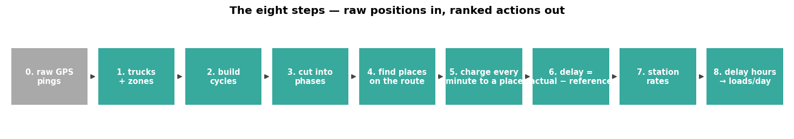

| Step | What it produces |
|---|---|
| 1 | trucks and zones identified |
| 2 | cycles: load → dump → load |
| 3 | each cycle cut into four phases |
| 4 | the places on the route, classified |
| 5 | every minute assigned to exactly one place |
| 6 | **delay = actual − reference, per phase** |
| 7 | station rates and utilisation |
| 8 | delays converted to loads/day, ranked |

Each step consumes the output of the one before it. No step requires anyone to say what a place is used for.

> Eight steps. Identify trucks and zones. Build cycles. Cut each cycle into four phases. Find out which places lie on the route and classify them. Assign every minute to exactly one place. Compute delay as actual minus a reference, per phase. Measure how fast each station can go and how heavily it is used. Then convert the delays into loads per day and rank them.


---
---

# Step 1 — Identify the trucks and the zones

**Trucks.** `tracker_list` has a type field; keep `type = dump` → 89 haul trucks. The fleet (BN or other) is read from the vehicle label.

**Zones.** The mine labels its own areas. A zone is a **load zone** if its label contains the Mongolian word for loading (`ачилт`); otherwise it is a **dump zone**.

The 11 zones with polygon vertices are exactly the load and dump zones — which is what Step 2 needs. The other 93 (weighbridges, car parks, tarping points, junctions) have only a box; they enter at Step 4.

**Scope of this walkthrough:** load zone 25559, and the trucks that used it — 22 trucks, 30 days, November 2025.

> For trucks, the vehicle list has a type field; keeping type equal to dump gives 89 haul trucks. For zones, the mine labels its own areas, and a zone is a loading zone if its label contains the Mongolian word for loading. The 11 zones that have polygon vertices are exactly the load and dump zones, which is what cycle construction needs. The other 93 have only a box and come in later. This walkthrough follows one load zone and the 22 trucks that used it in November.

---
---

# Step 2 — Build cycles

**A cycle is the interval between two consecutive departures from the load zone.**

1. Join every ping to the 11 polygons → each ping is inside a zone, or nowhere.
2. Collapse consecutive pings in the same zone into one **visit**: `(zone, arrive, depart)`.
3. **A load-zone visit only counts if the truck actually stopped** — at least one ping at or below 2 km/h.
4. Walk the visit sequence per truck. Every `load → dump → load` is one cycle. Record its longest ping gap.

**Step 3 exists because presence is not arrival.** Without it, a truck clipping the corner of the polygon on its way past closes a cycle. Measured on BN November: **41% of "load visits" lasted under a minute** — median 12 seconds, 4 pings. Those are drive-throughs, and each one split a real trip in two or closed a trip that never happened.

**Dump visits are deliberately not held to the same test.** Only 43% of them contain a stopped ping, because the stockpile polygons were drawn once while the tipping face keeps moving. Reaching the dump area is taken as evidence the load was delivered.

**No trip is discarded for being slow.** A trip that takes 11 hours is either a truck that stood somewhere for a long time or a tracker that was switched off, and its duration cannot tell you which — of BN's November trips over 6 hours, **54% have continuous pings** and are simply long. A hole in the ping stream *can* tell them apart, so every trip is kept and its longest gap recorded alongside it.

| Output column | Meaning |
|---|---|
| `depart_load, arrive_unload, depart_unload, arrive_load` | the four timestamps |
| `dwell_own_s` | the load-zone stay, **measured from this visit's own arrival and departure** |
| `haul_s, dump_s, return_s` | duration of each phase |
| `haul_km, return_km` | path length, summed from consecutive ping distances |
| `max_gap_s`, `over_max_hours` | longest ping gap inside the trip; whether it ran over 6 h |
| `load_zone, unload_zone, tracker_id, date` | keys |

**BN, November 2025: 2 657 cycles · 22 trucks · 30 days.** 314 ran over 6 hours; 171 contain a ping gap longer than 15 minutes.

> A cycle is the interval between two consecutive departures from the load zone. Join every ping to the polygons, collapse consecutive pings in one zone into a visit, and walk the visit sequence reading off every load-then-dump-then-load as one cycle.
>
> Two rules matter more than they look. First, a load-zone visit only counts if the truck actually stopped. Without that, a truck clipping the corner of the polygon on its way past closes a cycle — and 41 percent of load visits lasted under a minute, a median of twelve seconds. Dump visits are deliberately not held to that test, because only 43 percent of them contain a stopped ping: the stockpile polygons were drawn once while the tipping face keeps moving.
>
> Second, no trip is discarded for being slow. A trip that takes eleven hours is either a truck that stood somewhere a long time or a tracker that was switched off, and the duration cannot tell you which — of the trips over six hours, 54 percent have continuous pings and are simply long. A hole in the ping stream can tell them apart, so every trip is kept and its longest gap recorded alongside it.
>
> For BN in November that is 2 657 cycles across 22 trucks and 30 days.


---
---

# Step 3 — Cut each cycle into four phases

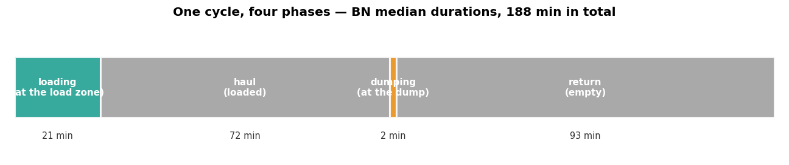

| Phase | Defined as | BN median | BN mean |
|---|---|---|---|
| **STAY** at the load zone | `arrive_load → depart_load`, same visit | **21.1 min** | 24.2 |
| **HAUL** (loaded) | `depart_load → arrive_unload` | **71.5 min** | 80.1 |
| **DUMP** | `arrive_unload → depart_unload` | **1.6 min** | 5.3 |
| **RETURN** (empty) | `depart_unload → arrive_load` | **93.5 min** | 173.3 |

The stay covers loading itself plus any waiting to be loaded.

**Medians are quoted throughout, not means.** Look at the return leg: median 93.5 min, mean 173.3. The mean is dragged by a small number of very long trips — and those are real trips, kept on purpose (Step 2). A mean would describe none of them well.

> Four phases, defined by the four timestamps. The stay at the load zone, which covers loading itself and any waiting to be loaded. Haul loaded, from leaving the load zone to arriving at the dump. Dump. And return empty. BN medians are 21, 72, 2 and 94 minutes. We quote medians rather than means throughout: on the return leg the median is 94 minutes and the mean is 173, dragged by a small number of very long trips that are real and kept on purpose.

---
---

# Step 3b — A phase duration is not a driving duration

A phase is defined by two timestamps, so its duration includes **anything the truck did in between, including standing still**.

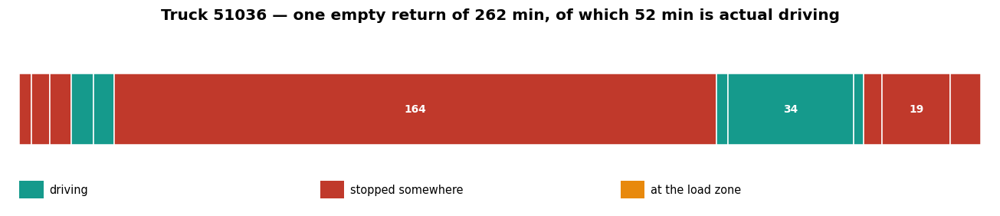

**Truck 51036, 6 November — one "empty return":**

```
04:05  left the dump
       STOPPED        11 min   still on the stockpile
       drove          12 min
       STOPPED       164 min   at a car park
       drove          34 min
       STOPPED        24 min   at the pit gate
       STOPPED         8 min   at the tarping point
08:44  reached the load zone

phase duration 279 min  =  46 min driving  +  233 min stationary
```

Across the whole month, **43% of haul + return time is a truck actually driving.**

> This is the point that determines everything downstream. A phase is defined by two timestamps, so its duration includes anything the truck did in between, including standing still. Here is one return phase — 279 minutes, of which 46 were driving and 233 were stationary: on the stockpile, at a car park, at the pit gate and at a tarping point. Across the whole month, 43 percent of haul plus return time is a truck actually driving. Steps 4 and 5 find out where the rest goes, and step 6 decides how each part is judged.


---
---

# Step 4 — Find the places on the route

Two measurements, applied to **all 104 zones**. Neither reads a place name.

**Coverage** = visits during haul/return phases ÷ number of cycles
→ a place passed on both phases of every trip scores ≈ 200%

**Stop rate** = share of those visits containing at least one ping at ≤ 2 km/h
→ separates a place trucks **stop at** from a place they **drive through**

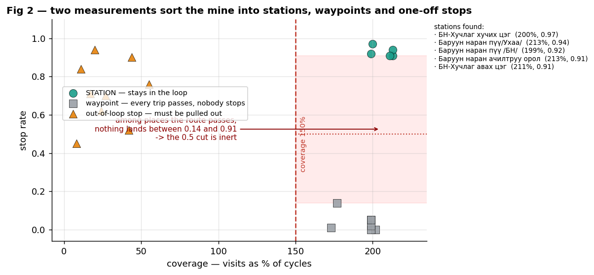

## Three classes

| Class | Test | BN result | Treatment |
|---|---|---|---|
| **STATION** | coverage ≥ 150% **and** stop rate ≥ 0.5 | 5 places, stop rate **0.91–0.97**: two weighbridges, two tarping points, the pit gate | part of the loop — has a service time and can have a queue |
| **WAYPOINT** | coverage ≥ 150% **but** stop rate < 0.5 | 6 places, stop rate **0.00–0.14**: junctions, turns, mileposts | its time counts as driving |
| **OUT OF LOOP** | coverage < 100% | car park 16% of trips (median 40 min), klonk 42% | removed from the loop, reported separately |

**Why the stop-rate test is needed.** Junctions are passed by every truck on every trip, so coverage alone would classify four road junctions as stations.

**Why places below 100% must be removed.** The reference in Step 6 is built from the fastest trips. A place visited on only 16% of trips does not appear in those fast trips, so its time would be charged in full to the road — a shift handover would be reported as road delay.

**Merging.** Zones whose boxes overlap are merged first: the tarping point and the weighbridge beside it are 100 m apart, and a truck queues once for the pair. BN ends up with two station complexes — one at the pit end, one at the dump end.

> We need to find out what else is on this loop, and we cannot ask the site what anything is. So for all 104 zones we ask the GPS two questions. First, does every trip pass here — visits divided by cycles, so a place passed on both phases of every trip scores about 200 percent. Second, do trucks actually stop, or just drive through — the share of visits containing a ping at two kilometres an hour or below.
>
> The second question is not optional. Junctions are passed by every truck on every trip too, so coverage alone would classify four road junctions as stations.
>
> Three classes come out. Stations: coverage around 200 percent and trucks stop — two weighbridges, two tarping points and the pit gate, stop rates between 0.91 and 0.97. Waypoints: coverage around 200 percent but nobody stops, stop rates between zero and 0.14; their time counts as driving. And anything below 100 percent coverage is removed from the loop entirely — the car park is visited on 40 percent of trips for a median of 11 minutes and the repair yard on 11 percent for a median of 100 minutes, and if they stayed in, that standing time would be reported as road delay.


---
---

# Step 5 — Assign every minute to exactly one place

For every consecutive pair of pings inside a haul or return phase, the interval is charged to:

- the **smallest zone box** containing the earlier ping, if there is one
- otherwise **DRIVING** if speed > 2 km/h
- otherwise **STOPPED-UNMAPPED**

Intervals longer than 5 minutes are capped at 5 (GPS gaps; 0.3% of intervals).
Smallest box wins, so a large box cannot absorb the pings of a small one inside it.

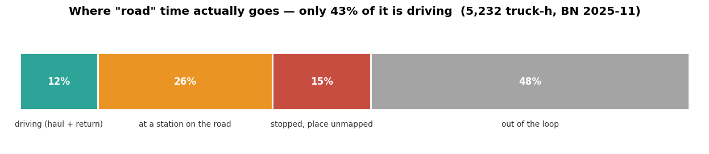

**The identity:**

```
phase duration  =  Σ station time  +  driving  +  stopped-unmapped  +  out-of-loop  +  unrecorded
```

The last term is phase time the ping stream cannot account for: a hole contributes at most the 5-minute cap, so a trip that ran while the tracker was off leaves a shortfall. For BN November it is **12.7%** of phase time. It is booked so the identity closes exactly, and it is kept **out of the ranking** — it is missing data, not recoverable time.

## Checking the "stopped" rule against an independent sensor

The rule is ours. The odometer is a different sensor from the GPS position.

| Intervals classified as | Total duration | Odometer advanced | Implied speed |
|---|---|---|---|
| **STOPPED** (speed ≤ 2 km/h) | 6 615 truck-h | 1 697 km | **0.3 km/h** |
| **DRIVING** | 6 370 truck-h | 225 363 km | **35.4 km/h** |

Only **0.7%** of the time classified as stopped shows any odometer movement.
The device's own parking flag agrees **92%** of the time, and every disagreement is one-directional — the flag is set a little after the truck comes to rest.

> Every consecutive pair of pings inside a phase gives an interval, and that interval is charged to the smallest zone box containing the earlier ping. If no box contains it, the interval is driving if the speed is above two kilometres an hour, and stopped-unmapped if not. The result is an identity: phase duration equals station time plus driving plus stopped-unmapped plus out-of-loop time, and the two sides agree to within 0.8 percent.
>
> The "stopped" rule is ours, so we checked it against the odometer, which is a different sensor. Over the intervals we call stopped, the odometer advanced at 0.3 kilometres an hour. Over the intervals we call driving, 35.4. Only 0.7 percent of stopped time shows any odometer movement at all.

---
---

# Step 6 — Delay = actual − reference

**This is the core of the method.** Every phase has a measured quantity and a reference; the delay is the difference.

| Phase | Quantity measured | Compared against | Where the reference comes from | BN value |
|---|---|---|---|---|
| **Loading** | the load-zone stay | no-queue loading time | **median stay across visits where no other truck was present** | 13.3 min |
| **Station** | time inside a station box | service time | **median dwell of visits where no other truck was present** | 4.6–8.2 min |
| **Dump** | time inside the dump zone | clean dump time | 20th percentile of dump duration | 0.7 min |
| **Haul road** | **driving time only**, loaded | free-flow time | 15th percentile of driving-only haul time | 60.5 min |
| **Return road** | **driving time only**, empty | free-flow time | 15th percentile of driving-only return time | 58.1 min |

**Every reference is this fleet's own performance for that same phase** — what it achieves when nothing is in the way. Nothing is compared against a manufacturer's figure or a management target.

**The load zone and the stations use the same rule, and it is not a percentile.** Loading takes as long as it takes when nobody else is there; that median is the reference, and anything beyond it is the thing to explain.

## What the load-zone stay looks like

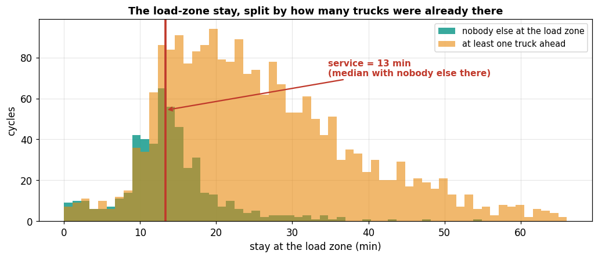

The two distributions are the same measurement split by what was happening around the truck. With nobody else at the load zone the stay clusters tightly around 13 minutes — that is loading, and it is the reference. With trucks already there it spreads to the right, and that spread is what Step 6b separates out.

**No cut-point is needed anywhere in this.** The reference is a median of a subset, not a boundary drawn through a distribution.

> Here is what the load-zone stay looks like. The two distributions are the same measurement, split by what was happening around the truck. With nobody else there the stay clusters tightly around thirteen minutes — that is loading, and that is the reference. With trucks already there it spreads to the right, and that spread is what we separate out next. Note that no cut-point is needed anywhere in this: the reference is the median of a subset, not a boundary drawn through a distribution.

---

## Step 6b — The load-zone stay: three parts

**The test is not duration** — it is how many other trucks were already at the load zone when this one arrived.

| Part | Test | Counts as |
|---|---|---|
| **service** | `min(stay, median stay with nobody else present)` | not a delay — this is what loading takes |
| **QUEUE** | the excess when **≥1** truck was already there | delay, inside the loop |
| **unexplained** | the excess when **no** other truck was there | reported on its own, not folded into either |

Two stays of 13 and 30 minutes are the same kind of event judged on duration alone. The difference is that one of them had trucks in front of it.

**November totals:** service **591** truck-h · queue **493** · unexplained **22**

**Parking and breaks do not appear here at all.** They are not part of a measured load-zone stay. Where a truck sits between trips is decided in Step 5, by the place it is actually sitting.

*Nothing in this method asks what time of day it is. It would not help: this mine runs two 12-hour shifts, and **47% of its dump arrivals happen between 20:00 and 08:00**. A rule that treated night-time standing as parking would misread half the operation.*

> The load-zone stay splits three ways, and the test is not how long the truck waited. It is how many other trucks were already there when it arrived. Service is the stay capped at the median stay measured with nobody else present. Queue is the excess when at least one truck was already there. And the excess with nobody there is reported on its own, because we cannot say what caused it.
>
> Parking and breaks do not appear here at all — they are not part of a measured stay. Where a truck sits between trips is decided by the place it is actually sitting. Nothing in the method asks what time of day it is, and it would not help if it did: this mine runs two twelve-hour shifts, and 47 percent of its dump arrivals happen between eight at night and eight in the morning. A rule that treated night-time standing as parking would misread half the operation.

---

## Step 6c — Waiting at a station: three parts

| Part | Definition |
|---|---|
| **service** | `min(dwell, median dwell when no other truck was present)` |
| **queue** | the excess, when ≥1 truck was already there on arrival |
| **unexplained** | the excess when **no** other truck was there — reported on its own |

The third part is **not** added to service and **not** added to queue, because we cannot say what caused it.

| Station complex | Total | Service | Queue | Unexplained | Service time |
|---|---|---|---|---|---|
| weighbridge + tarping, **dump side** | 1 265 h | 402 | **769** | 94 | 4.6 min |
| gate + weighbridge + tarping, **pit side** | 1 093 h | 592 | **470** | 31 | 8.2 min |

**The test that the middle part behaves like a queue:** the stay should rise with the number of trucks already present.

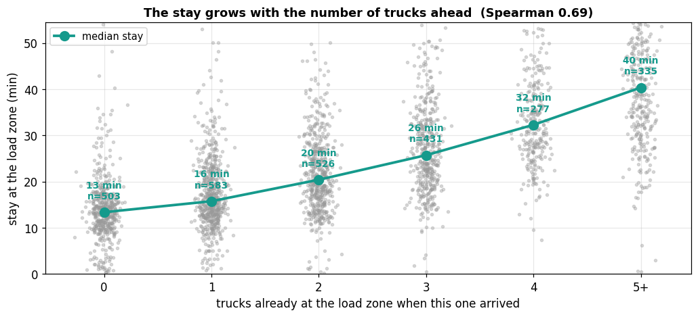

At the load zone it rises cleanly and monotonically — **13.3 min with nobody ahead, 15.7 with one, 20.4 with two, 25.7 with three, 32.3 with four, 40.3 with five or more** (Spearman **0.69**, n = 2 655).

At the two road-side complexes the same relationship is present but much weaker (Spearman 0.22 and 0.24), so for those it supports the reading rather than establishing it.

> At a station we do the same split, three parts. Service is the dwell capped at the median dwell measured when no other truck was present. Queue is the excess when at least one truck was already there. And the excess when no other truck was there is reported on its own — we do not add it to service and we do not add it to queue, because we cannot say what caused it.
>
> The test that the middle part behaves like a queue is that dwell should rise with the number of trucks already present. It does at every station, from 2.7 minutes at zero trucks to 6.4 at four. The correlation is weaker than at the load zone, so this supports the reading rather than establishing it.

---
---

# Step 7 — How fast each station can go

Sort the departures from a zone, take the gap between consecutive ones.

**Keep only gaps under 30 minutes.** A longer gap is a period when the station was idle waiting for a truck, so including it would measure how often trucks arrive rather than how fast the station can work.

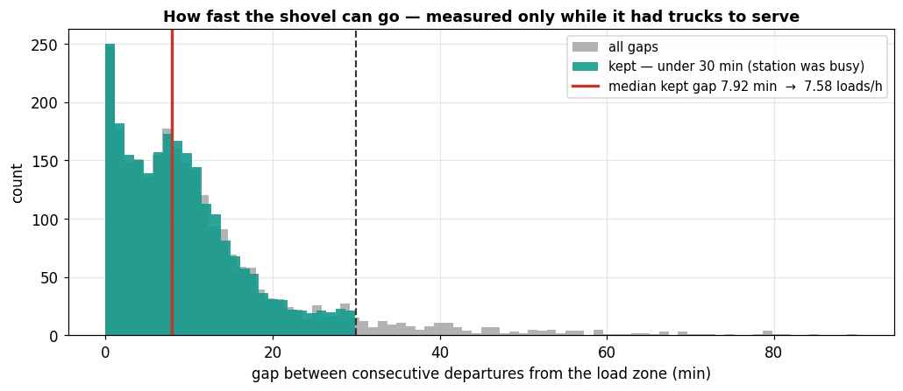

```
median kept gap  =  7.92 min per load        ← a PERIOD
rate             =  60 ÷ 7.92 = 7.58 loads/h  ← a RATE
```

The **60** converts minutes to an hour. The **division** is because a rate is the reciprocal of a period — like litres per 100 km versus kilometres per litre.

Dump zone, same method: **8.9 loads/h**.

## Operating hours

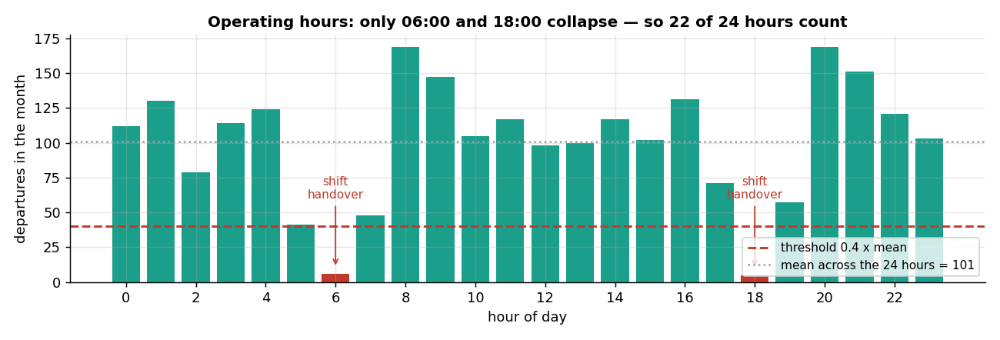

Group all departures by hour of day; take the mean across the 24 hours. An hour counts as operating if its count reaches **0.4 × that mean**.

Only **06:00, 18:00 and 19:00** fall below — the two shift handovers. So **21 of 24 hours** count.

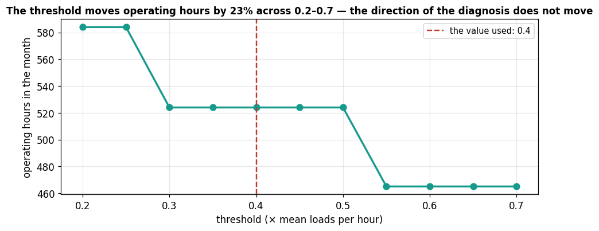

**The 0.4 is a chosen value.** Across 0.2–0.7 the count moves by a few hours and the excluded hours are always the handover hours.

## Utilisation

| | Formula | BN November |
|---|---|---|
| flow | loads per day ÷ operating hours | 88.6 ÷ 21 = **4.22 loads/h** |
| utilisation, shovel | flow ÷ shovel rate | 4.22 ÷ 7.58 = **0.56** |
| utilisation, dump | flow ÷ dump rate | 4.22 ÷ 8.9 = **0.48** |
| binding station | the higher utilisation, compared against **1.0** | **shovel, at just over half capacity** |

> To know how fast a station can go, sort its departures and take the gap between consecutive ones. Keep only gaps under thirty minutes — a longer gap is a period when the station was idle waiting for a truck, so including it would measure arrivals rather than capacity.
>
> The median kept gap is a period, in minutes per load: 7.92 minutes at the BN shovel. To turn that into a rate we divide — sixty minutes per hour over 7.92 minutes per load gives 7.58 loads per hour. The sixty converts minutes to an hour, and the division is because a rate is the reciprocal of a period.
>
> For utilisation we also need how many hours a day the operation runs. Group departures by hour of the day; an hour counts as operating if it reaches 0.4 times the mean across the 24 hours. Only the handover hours fall below, so 21 of 24 count. That 0.4 is a chosen value, and across 0.2 to 0.7 the count moves by a few hours while the hours excluded stay the same ones.
>
> Flow is then 88.6 loads over 21 hours, 4.22 an hour. Utilisation is 0.56 at the shovel and 0.48 at the dump, compared against 1.0 which is full. The shovel is the more heavily used of the two, at just over half capacity.

---
---

# Step 8 — Convert delay hours into loads per day

The delays from Step 6 are in truck-hours. To rank them we need loads per day.

**The identity:**

```
cycling truck-hours per day  =  loads per day × loop time ÷ 60
                        417  =  88.6 × 282.4 ÷ 60

read the other way:
loads per day  =  truck-hours × 60 ÷ loop time
```

Two kinds of delay convert differently:

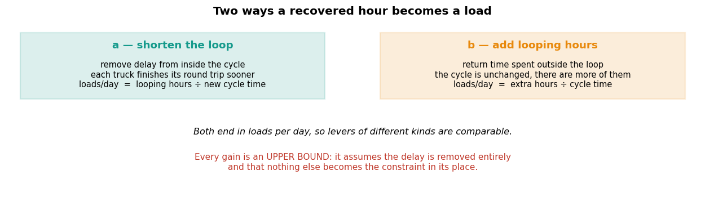

| | Applies to | What changes |
|---|---|---|
| **a — shorten the loop** | delay **inside** the loop: queue, dump, station waiting, slow driving | truck-hours held at 417, **loop time drops** |
| **b — add looping hours** | time **outside** the loop: stopped off the loop | loop time held at 282 min, **truck-hours rise** |

**Assumption in (a):** the fleet keeps committing the same truck-hours once the loop is shorter. If the response is to park trucks instead, the gain does not appear.

## Worked example — the queue at the load zone

| Step | Arithmetic | Result |
|---|---|---|
| bucket (from Step 6) | — | 493 truck-h / month |
| per day | 493 ÷ 30 | 16.4 truck-h/day |
| per load | 16.4 ÷ 88.6 loads | 0.185 h = **11.1 min** |
| new loop time | 282.4 − 11.1 | **271.3 min** |
| new loads per day | 417 × 60 ÷ 271.3 | **92.2** |
| gain | 92.2 − 88.6 | **+3.6 loads/day** |

**Two properties worth knowing.**

The obvious shortcut — freed hours ÷ loop time — gives **+3.5**, not 3.6. The difference is that shortening the loop also makes the truck-hours **already in it** more productive.

**The gains are not additive.** The ten items sum to **+25.8/day** individually; removing all of them at once gives **+34**. Loads per day varies inversely with loop time, so each further minute removed is worth more than the last. **The ranking is used for ordering only** — we never publish a sum.

> The delays are in truck-hours; to rank them we need loads per day. Start from an identity: cycling truck-hours per day equals loads per day times loop time over sixty — 417 equals 88.6 times 282.4 over sixty. Read the other way, loads per day equals truck-hours times sixty over loop time.
>
> Two kinds of delay. Delay inside the loop — queue, dump, station waiting, slow driving — where the truck is in the loop but not producing. Removing it shortens the loop, so the same truck-hours produce more loads. And time outside the loop, where the truck is not in the loop at all; recovering it adds truck-hours to the same loop.
>
> Worked through for the shovel queue: 493 truck-hours a month is 16.4 a day, which spread over 88.6 loads is 11.1 minutes per load. The loop drops from 282 to 271 minutes, and the same 417 truck-hours now give 92.2 loads a day. A gain of plus 3.6.
>
> Two things to know. The obvious shortcut, freed hours over loop time, gives 3.5 rather than 3.6 — the difference is that a shorter loop also makes the existing truck-hours more productive. And the gains are not additive: individually the ten items sum to 25.8 a day, but removing all of them at once gives 34. So the ranking is used for ordering only.

---
---

# Output — result for BN, November 2025

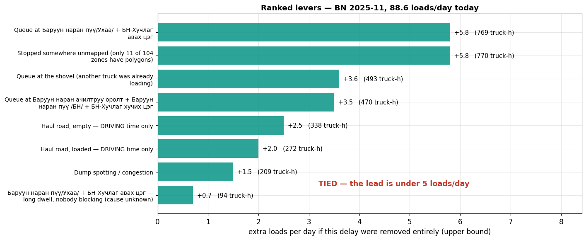

| # | Lever | Bucket | Mechanism | Gain |
|---|---|---|---|---|
| 1 | Queue, dump-side station complex | 769 h | a | **+5.8** |
| 2 | Stopped, unmapped · *unexplained* | 770 h | a | **+5.8** |
| 3 | Queue at the shovel | 493 h | a | +3.6 |
| 4 | Queue, pit-side station complex | 470 h | a | +3.5 |
| 5 | Haul road, empty — *driving time only* | 338 h | a | +2.5 |
| 6 | Haul road, loaded — *driving time only* | 272 h | a | +2.0 |
| 7 | Dump spotting / congestion | 209 h | a | +1.5 |
| 8 | Dump-side complex — long stay, nobody blocking | 94 h | a | +0.7 |

**Reported separately — outside dispatch control:** stopped off the loop (car park, yard) 2 488 h · phase time the GPS did not record 1 426 h

**First and second place are tied** — 5.8 against 5.8, far inside the 5 loads/day margin. There is no single first priority this month.

---

## Four rules before reporting

**1. Separate what dispatch cannot change.**
Time stopped off the loop, and phase time the GPS never recorded, leave the ranking and are reported on their own.
*Both are larger than every dispatch lever. Neither is something a dispatcher can act on: one is where trucks go between trips, the other is missing data.*

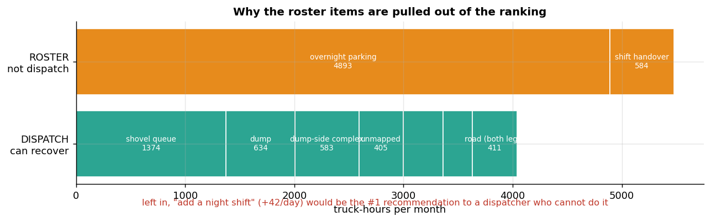

**2. Do not name a first place inside the noise.**
Name a single winner only if it leads the second by **≥ 5 loads/day**.

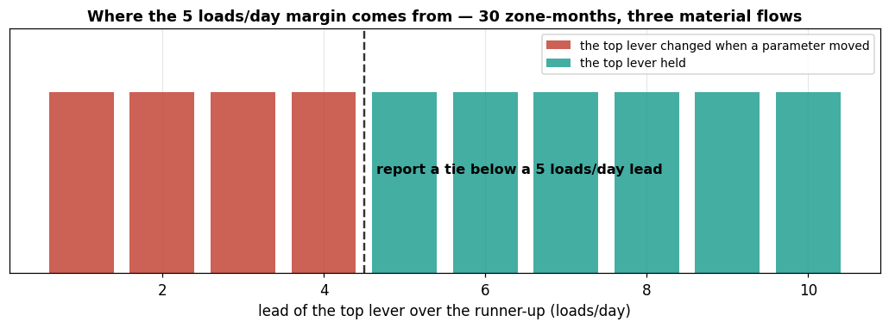

*The threshold is measured: across 3 material flows × 5 months × 5 parameter settings, every change in first place occurred when the lead was 1–4 loads/day; of the 20 cases with a lead of 5 or more, **none changed**.*

| Month | #1 | #2 | Margin | Verdict |
|---|---|---|---|---|
| November | dump-side complex +5.8 | stopped, unmapped +5.8 | 0.0 | **tied — report both** |

**All five months come out tied.** After the Step 2 corrections no lever clears the margin in any month. The honest output is "several things are worth roughly the same", not a prioritised list — and saying so is the point of the rule.

**3. Label what is measured but not explained.**
"Stopped, unmapped" is **joint first** at 770 truck-h. The odometer confirms the trucks were stationary, but we cannot say where or why — 93 zones have no polygon. It carries a label saying so.
*This is now the sharpest result in the report: the largest identified item is a gap in the zone data, not a finding about the operation. Getting the remaining polygons would do more than any dispatch change we can currently rank.*

**4. Report a range, not a point.**

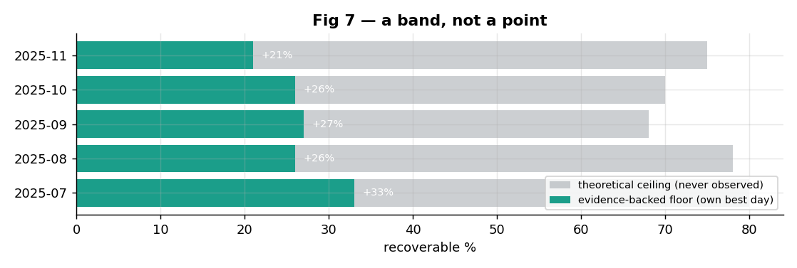

| | Value | Basis |
|---|---|---|
| **floor** | **+21%** | every normal day matches this fleet's own best day — **120 loads against an average of 98.8 over the month's 26 normal days**; *it has been achieved* |
| of which | +6% | more trucks turned out — maintenance |
| of which | **+13%** | **more trips per truck — the part that depends on dispatch** |
| **ceiling** | +38% | all in-loop delay removed at once — *never observed* |

*The floor has a known weakness: it measures variation between days, so an operation that is uniformly slow would score +0%.*

**Stoppage days are reported on their own:** 4 days in November cost 308 loads = **12% of the month** — larger than every dispatch lever, and not a dispatch problem.

---

## What the agent outputs

> **The constraint is not loading capacity.** The shovel is at 56% utilisation and the dump at 48%. Neither is close to full, so queueing in front of them points to uneven arrival timing rather than insufficient capacity. Do not buy loading equipment on this evidence.
>
> **There is no single first priority this month.** The dump-side station queue (+5.8) and time stopped in places we cannot identify (+5.8) are level, with the shovel queue (+3.6) and the pit-side station queue (+3.5) close behind. Four items worth roughly the same.
>
> **The largest identified item is a data gap, not an operational finding.** 770 truck-hours of trucks standing still in places that have no polygon. Obtaining the remaining 93 zone outlines would resolve it and is the highest-value next step.
>
> **The road is not the problem.** Both road items together are worth +4.5/day, ranked 5th and 6th, and that is driving time only.
>
> **Outside dispatch control, and larger than any lever:** 2 488 truck-hours stopped off the loop, 1 426 truck-hours the GPS never recorded, and four stoppage days costing 12% of the month.
>
> **Recoverable: +21%** with observational support, of which about **+13 percentage points** depends on trips per truck rather than on how many trucks were turned out.
>
> **This is a diagnosis.** Showing that acting on any of these produces the gain requires a before/after comparison.

> Here is what comes out. The shovel is at 56 percent utilisation and the dump at 48. Neither is close to full, so queueing in front of them points to uneven arrival timing rather than insufficient capacity.
>
> There is no single first priority this month. The dump-side station queue and time stopped in places we cannot identify are level at plus 5.8 each, with the shovel queue and the pit-side queue close behind. Four items worth roughly the same, so we report them as a group rather than a ranking.
>
> The largest identified item is a data gap rather than an operational finding — 770 truck-hours of trucks standing still in places that have no polygon. Getting the remaining 93 zone outlines would resolve it, and that is the highest-value next step.
>
> The road is not the problem: both road items together are worth four and a half loads a day, ranked fifth and sixth, and that is driving time only.
>
> Larger than any of these but outside dispatch control: nearly 2 500 truck-hours stopped off the loop, 1 400 truck-hours the GPS never recorded, and four stoppage days costing twelve percent of the month.
>
> Recoverable is plus 21 percent with observational support, of which about thirteen percentage points depends on trips per truck rather than on how many trucks were turned out.
>
> And this is a diagnosis. Showing that acting on any of these produces the gain requires a before-and-after comparison.

---
---

# Checks — five months

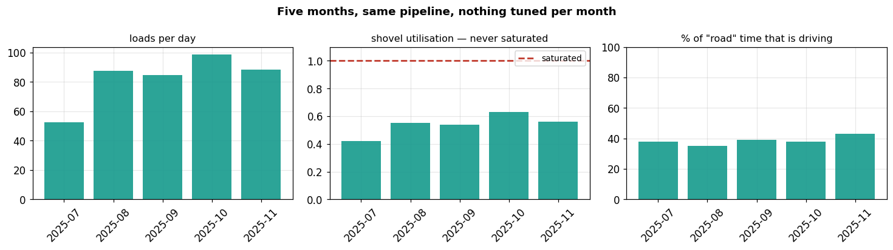

Same code, five months, nothing adjusted between them.

| | Jul | Aug | Sep | Oct | Nov |
|---|---|---|---|---|---|
| loads per day | 52.4 | 87.4 | 84.5 | 98.9 | 88.6 |
| shovel utilisation | 0.42 | 0.55 | 0.54 | 0.63 | 0.56 |
| shovel saturated? | no | no | no | no | no |
| share of phase time actually driving | 38% | 35% | 39% | 38% | 43% |
| first place | dump-side complex | dump-side complex | dump-side complex | stopped, unmapped | dump-side complex |
| named, or tied | tied | tied | tied | tied | tied |

**Two things to read off this table.** The shovel never saturates in any month — the one conclusion that survived every correction to the pipeline, and the one that agrees with the collaborator's own utilisation figures. And first place is a tie in all five months: no lever clears the 5 loads/day margin anywhere, so the diagnosis is a group of comparable items rather than a ranked list.

> Same code on five months, nothing adjusted between them. Loads per day range from 52 to 99. Shovel utilisation from 0.42 to 0.63 — never near full, in any month. The share of phase time that is actually driving sits between 35 and 43 percent.
>
> Two things to read off this. The shovel never saturates, which is the one conclusion that survived every correction we made to the pipeline. And first place is a tie in all five months — no lever clears the five loads a day margin anywhere — so what we report is a group of comparable items, not a ranked list.

---

## Chosen values, and what was tested

| Value | Used for | Tested over | Result |
|---|---|---|---|
| Value | Used for | Tested over | Result |
|---|---|---|---|
| **0.5 stop rate** | station vs waypoint | the observed distribution, five months | on-route places sit at 0.00–0.20 or 0.89–0.97 — **nothing in between**, so any cut in that gap gives the same answer |
| **2 km/h** | stopped vs driving | the odometer, a different sensor from GPS position | over time called stopped the odometer advances at 0.3 km/h; over time called driving, 35.4 |
| **≥1 truck present** | queue vs service | the stay against the number of trucks already there | rises monotonically 13 → 40 min, Spearman 0.69 |
| **5 loads/day** | when to name a winner | 30 zone-months, three material flows | every change of first place happened at a lead of 1–4; none of the 20 cases at 5 or more changed |
| **p15 / p20** | free-flow road and clean-dump references | **not re-swept on the current pipeline** | the earlier sweep was run before the leg and cycle construction changed, so it is not quoted here |

**No throughput ceiling is quoted anywhere in this document.** The value implied by the station rates is unstable under plausible parameter choices, so it is used internally as a cap and never reported as a figure.

---

## Limits

**The function of a station is not verified.**
We can show that trucks stop at five fixed places on every trip, for 3–8 minutes, and that the wait grows when other trucks are present. The names come from the mine's own zone labels.
→ the correct phrasing is *"trucks dwell here for 5.8 minutes"*, **not** *"tarping takes 5.8 minutes"*.

**Zone geometry.** 93 of 104 zones are rectangles plus a buffer. The "stopped, unmapped" item is largely a consequence of that. Closing it needs the zone API.

**Units.** No payload data, so loads and truck-hours only — never tonnes.

**Coverage.** One material flow, one mine, July to November. **No winter months.**

**Nothing clears the margin.** First place is a tie in all five months. The output is a group of comparable items, not a priority list, and the largest identified item is a gap in the zone data rather than a finding about the operation.

**Status.** This is a diagnosis, not a demonstrated improvement.

> Five limits. The function of a station is not verified — we can show trucks stop at five fixed places for three to eight minutes and that the wait grows when others are present, but the names come from the mine's own labels, so the correct phrasing is "trucks dwell here for 5.8 minutes", not "tarping takes 5.8 minutes". 93 of 104 zones are rectangles plus a buffer, and the unmapped item is largely a consequence of that. No payload data, so loads and truck-hours only. One flow, one mine, July to November, no winter. Nothing clears the tie margin in any month, so what comes out is a group of comparable items rather than a priority list. And this is a diagnosis rather than a demonstrated improvement.

---
---

## Appendix — the figures used

| File | Shows |
|---|---|
| `t_fig_pipeline.png` | the eight steps |
| `c_fig_phases.png` | the four phases of a cycle |
| `c_fig_onetrip.png` | truck 51036, one return phase broken down |
| `v4_fig2_topology.png` | coverage vs stop rate, all zones |
| `v4_fig3_legs.png` | where phase time goes |
| `v4_fig1_dwell.png` | the load-zone stay, split by how many trucks were already there |
| `v4_fig4_conc.png` | dwell vs concurrency at each station |
| `t_fig_gaps.png` | departure gaps → shovel rate |
| `t_fig_hours.png`, `t_fig_hours_sens.png` | operating hours and the 0.4 threshold |
| `t_fig_mechanisms.png` | the two conversions |
| `t_fig_levers.png` | the ranked result |
| `t_fig_ownership.png` | what dispatch can act on vs what it cannot |
| `t_fig_tierule.png` | where the 5 loads/day margin comes from |
| `v4_fig7_range.png` | floor and ceiling per month |
| `v4_fig6_months.png` | five-month stability |